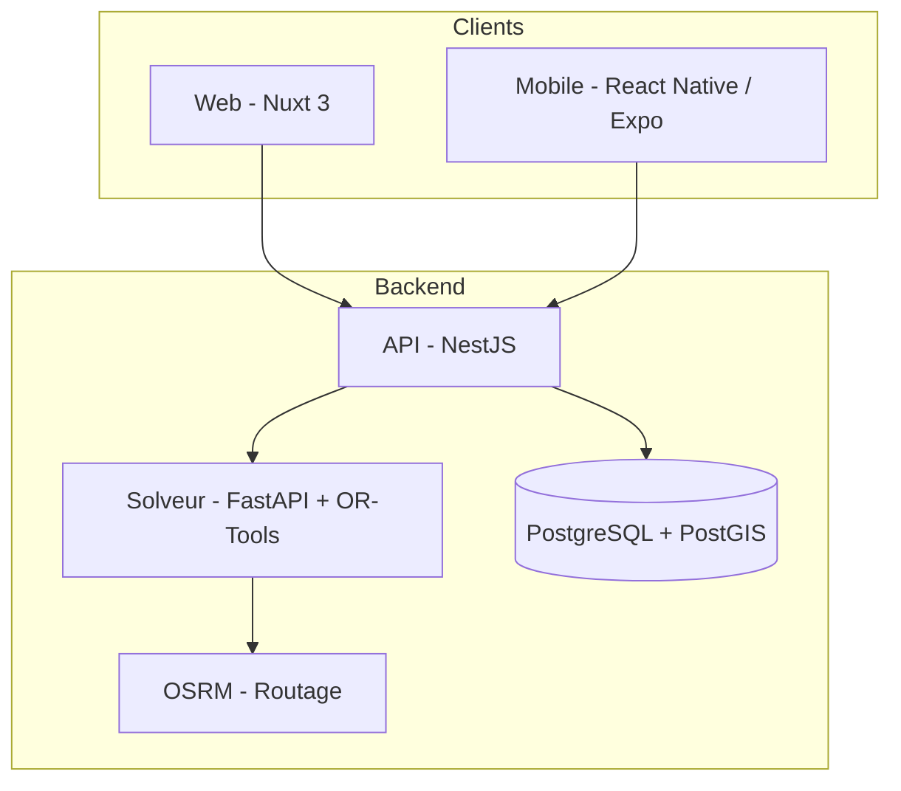

# [NOM_DU_PROJET]

> Plateforme moderne de gestion et d'optimisation de tournées pour infirmier(e)s libéral(e)s à domicile.

<!-- BADGES À AJOUTER QUAND DISPO : build status, license, version -->

<!-- CAPTURE / GIF DE DÉMO À AJOUTER ICI -->

## 📖 L'histoire derrière le projet

Ce projet est né d'un constat concret : une infirmière libérale de mon entourage utilise quotidiennement une plateforme métier (AgatheYou) pour saisir ses patients à partir d'ordonnances. Mais cette plateforme souffre de plusieurs limitations majeures :

- Pas d'optimisation intelligente de l'ordre des visites
- Pas de prise en compte des contraintes médicales horaires (un patient diabétique doit recevoir son insuline avant le petit-déjeuner)
- Pas d'application mobile pensée pour l'usage en déplacement
- Pas de synchronisation fiable entre les appareils

L'objectif de ce projet est de construire une alternative moderne, en partant des besoins terrain réels d'un(e) IDEL, et en s'appuyant sur des techniques d'optimisation issues de la recherche opérationnelle.

## 🎯 Fonctionnalités

### Cœur métier
- Saisie rapide de patients à partir d'une ordonnance
- Gestion des ordonnances, soins et fréquences de passage
- Planification de tournées multi-jours

### Différenciation
- **Optimisation automatique de tournée** via Google OR-Tools (résolution du VRPTW : Vehicle Routing Problem with Time Windows)
- **Routage réel** via OSRM self-hosté (distances et temps de trajet exacts, pas à vol d'oiseau)
- **Contraintes médicales** : fenêtres horaires, priorités, durées de soin par type d'acte
- **Mode hors-ligne** sur mobile (la tournée du jour reste accessible sans réseau)
- **Synchronisation temps réel** entre web et mobile

### À venir
- OCR d'ordonnance (extraction automatique des soins depuis une photo)
- Facturation NGAP intégrée
- Notifications push (rappels, retards)

## 🏗️ Architecture



### Stack technique

| Couche | Techno | Justification |
|---|---|---|
| Backend API | **NestJS** (TypeScript) | Architecture modulaire, DI, productivité TS |
| Base de données | **PostgreSQL + PostGIS** | Requêtes géospatiales natives |
| Frontend Web | **Nuxt 3** | SSR, écosystème Vue, partage TS |
| Mobile | **React Native + Expo** | Cross-platform, partage de code |
| Optimisation | **Python + FastAPI + Google OR-Tools** | Solveur de référence pour les VRP |
| Routage | **OSRM** self-hosted | Pas de quota, contrôle total |
| Géocodage | **API Adresse** (data.gouv.fr) | Gratuit, optimisé France |
| Auth | **Better-Auth** | Moderne, self-hosted |
| Monorepo | **pnpm workspaces** | Partage de packages internes |

### Structure du monorepo

```
.
├── apps/
│   ├── api/          # Backend NestJS
│   ├── web/          # Frontend Nuxt 3
│   ├── mobile/       # Application Expo
│   └── solver/       # Microservice Python d'optimisation
├── packages/
│   ├── types/        # Types TS partagés
│   └── validation/   # Schémas Zod partagés
├── docker-compose.yml
└── README.md
```

## 🧠 Le défi algorithmique

Le problème d'optimisation de tournée est une variante du **Vehicle Routing Problem with Time Windows (VRPTW)**, NP-difficile. Les contraintes modélisées :

- **Fenêtres horaires strictes** (ex : insuline avant 8h)
- **Durées de service variables** selon le type de soin
- **Distances réelles** issues du graphe routier (OSRM)
- **Heures de travail** de l'infirmier (début, fin, pauses)

La résolution se fait par OR-Tools (recherche locale guidée), exposé via un microservice Python isolé du backend principal.

## 📦 Modèle de données

> Schéma simplifié, voir [`docs/schema.md`](./docs/schema.md) pour le détail.

- **Infirmiers** : utilisateurs de la plateforme
- **Patients** : avec adresse géocodée (point PostGIS)
- **Ordonnances** : prescriptions médicales
- **Soins** : actes individuels (cotation NGAP, durée, fréquence, priorité)
- **Tournées** : journée de travail planifiée
- **Visites** : arrêt dans une tournée

## 🗺️ Roadmap

- [ ] **Phase 0** — Cadrage, schéma BDD, choix du nom
- [ ] **Phase 1** — Fondations (NestJS, Postgres, auth, CRUD patients)
- [ ] **Phase 2** — Métier (ordonnances, soins, géocodage)
- [ ] **Phase 3** — Web (Nuxt 3)
- [ ] **Phase 4** — Optimisation (OR-Tools + OSRM)
- [ ] **Phase 5** — Mobile (Expo)
- [ ] **Phase 6** — Bonus (OCR, notifications, stats)

Suivi détaillé dans les [issues GitHub](../../issues).

## 🚀 Démarrage rapide

> Section à compléter une fois la phase 1 livrée.

```bash
# Cloner le repo
git clone [url]
cd [nom_projet]

# Lancer l'environnement
docker-compose up -d
pnpm install
pnpm dev
```

## ⚖️ Conformité & sécurité

Les données patients sont des **données de santé** au sens du RGPD. Bonnes pratiques appliquées dès le développement :

- Chiffrement des champs sensibles en base
- HTTPS obligatoire
- Authentification forte
- Aucune donnée réelle dans le repo (jeux de tests synthétiques uniquement)

Dans le cadre d'une éventuelle commercialisation, une migration vers un **hébergeur HDS** (Scaleway Healthcare, OVH Healthcare, Outscale) serait nécessaire.

## 🛠️ Stack résumée

`TypeScript` `NestJS` `Nuxt 3` `React Native` `Expo` `PostgreSQL` `PostGIS` `Python` `FastAPI` `Google OR-Tools` `OSRM` `Docker`

## 📄 Licence

[À DÉCIDER]

## 👤 Auteur

[À COMPLÉTER — ton nom, lien GitHub, éventuellement LinkedIn]
